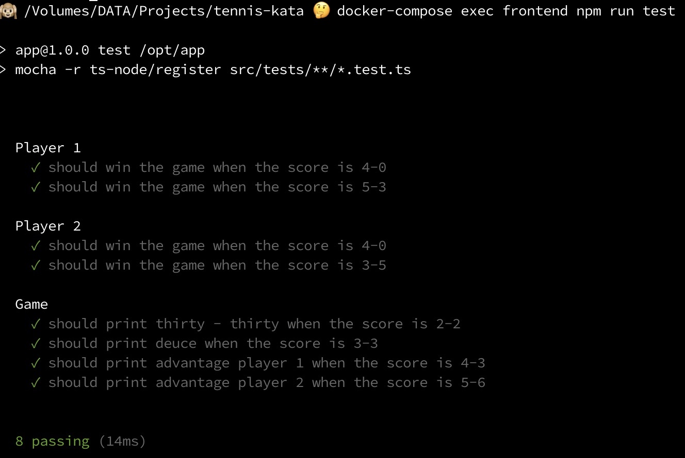
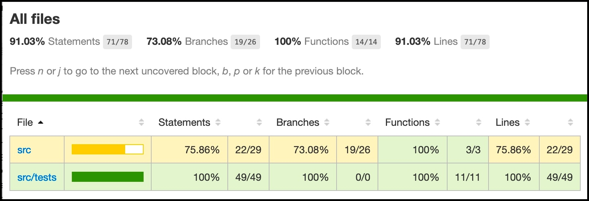

🤖🙊 This is my typescript homework. I will learn 
 * how to setup typescript project 
 * how to write functional programming code.
 * how to write documentation in typescript.

# Requirements
 * Mac (I haven't tested on Windows and Linux. You may try it)
 * docker >= 19.03
 * docker-compose >= 1.26

# Setup Project (First time only)
 1. Go to current project folder and run docker.
    ```
    docker-compose up -d
    ```
 1. Install dependencies
    ```
    docker-compose exec frontend npm install
    ```

# Run Tests
```
docker-compose exec frontend npm run test
```
Sample output <br/>  <br/>

# Run Test Coverage
```
docker-compose exec frontend npm run coverage
```
Then, open file 'project/coverage/index.html' in chrome. <br/>
Sample output <br/>  <br/>

# Problem description
https://docs.google.com/document/d/1Ux-LIeDNMmgQEgLOd5d7gU3gdMVXGYP7BwiITAaJMPY/edit#